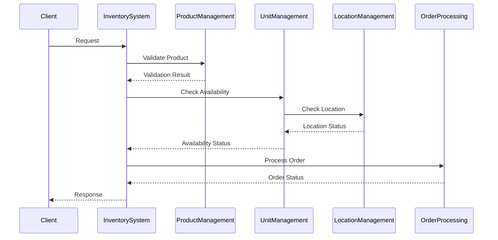

# Design Documentation

## System Architecture

### Overview
The Inventory Management System is built using a modular, object-oriented architecture that emphasizes:
- Scalability
- Thread safety
- Maintainability
- Extensibility

### Core Components

#### 1. Product Management Module
- Handles product lifecycle
- Maintains product catalog
- Manages product attributes and pricing
- Ensures data consistency

#### 2. Unit Management Module
- Tracks individual product units
- Manages unit states and transitions
- Handles unit location assignment
- Ensures thread-safe operations

#### 3. Location Management Module
- Manages warehouse storage spaces
- Handles space allocation
- Maintains location status
- Prevents location conflicts

#### 4. Order Processing Module
- Processes customer orders
- Manages order lifecycle
- Handles unit allocation
- Ensures atomic transactions

### Design Patterns Used

#### 1. Singleton Pattern
- Applied to InventorySystem
- Ensures single system instance
- Centralizes control
- Manages shared resources

#### 2. State Pattern
- Used in Order and Unit status management
- Defines clear state transitions
- Maintains state consistency
- Validates state changes

#### 3. Lock Pattern
- Implements thread safety
- Prevents race conditions
- Manages concurrent access
- Ensures data consistency

### Data Flow Architecture

### Concurrency Management

#### 1. Location-based Locking
- Granular locks per location
- Prevents multiple assignments
- Ensures atomic operations
- Manages deadlock prevention

#### 2. Order Processing Locks
- Prevents overselling
- Ensures inventory consistency
- Manages concurrent orders
- Maintains transaction integrity

#### 3. State Transition Locks
- Ensures valid state changes
- Prevents race conditions
- Maintains system consistency
- Handles concurrent updates

### Error Handling Strategy

#### 1. Validation Layer
- Input validation
- State validation
- Business rule validation
- Data consistency checks

#### 2. Exception Handling
- Custom exceptions
- Graceful failure handling
- Error logging
- Recovery mechanisms

#### 3. Transaction Management
- Atomic operations
- Rollback capabilities
- Consistency maintenance
- Data integrity preservation 