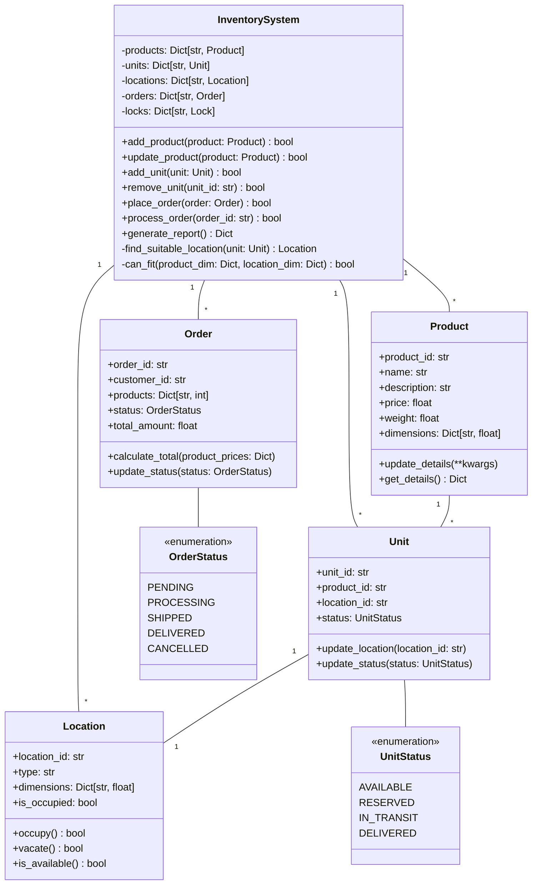

# UML Class Diagram Documentation

## Class Diagram

## Relationships

### 1. InventorySystem Relationships
- Has many Products (1:*)
- Has many Units (1:*)
- Has many Locations (1:*)
- Has many Orders (1:*)
- Manages all interactions between classes

### 2. Product Relationships
- One Product can have many Units (1:*)
- Products are referenced by Orders

### 3. Unit Relationships
- Belongs to one Product (1:1)
- Occupies one Location (1:1)
- Has one UnitStatus

### 4. Location Relationships
- Can contain one Unit (1:1)
- Managed by InventorySystem

### 5. Order Relationships
- Contains multiple Products
- Has one OrderStatus
- Managed by InventorySystem

## Class Responsibilities

### InventorySystem
- Central system management
- Coordination between components
- Thread safety enforcement
- Business logic implementation

### Product
- Product information storage
- Product detail management
- Product validation

### Unit
- Physical item representation
- Location tracking
- Status management

### Location
- Storage space representation
- Occupancy management
- Space validation

### Order
- Order information storage
- Order processing logic
- Status tracking

## Enumerations

### UnitStatus
- Defines possible unit states
- Ensures valid state transitions
- Used for inventory tracking

### OrderStatus
- Defines possible order states
- Ensures valid order progression
- Used for order tracking 